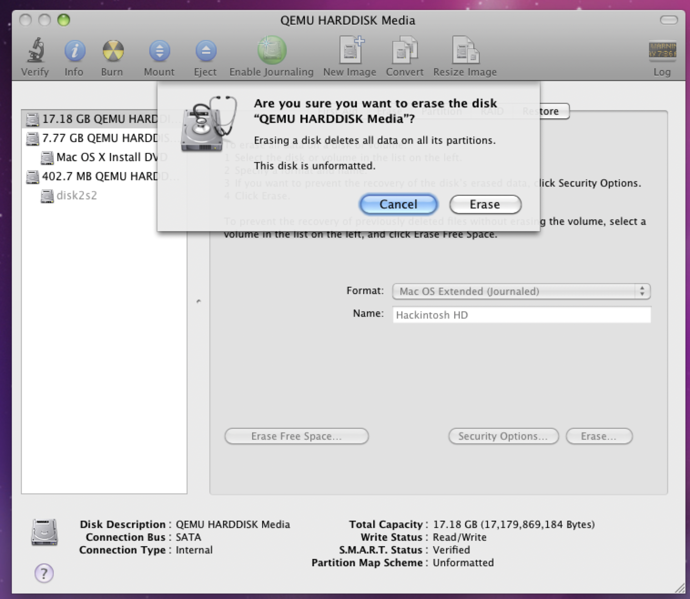
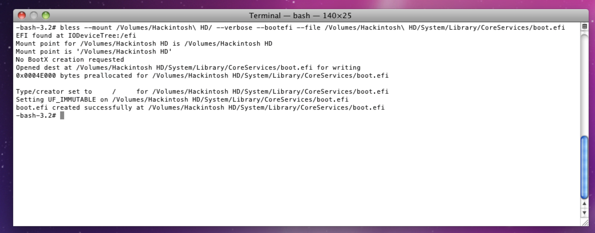
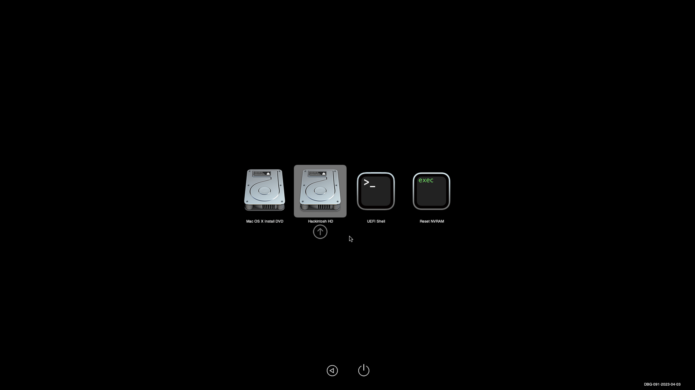
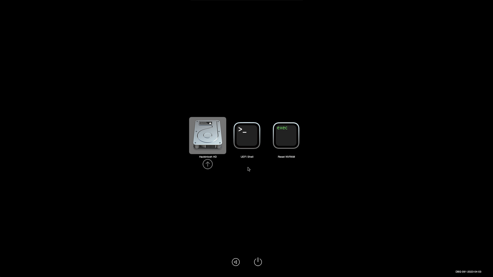

# How to install OS X Snow Leopard with OpenCore KVM

### 0. Things you'll need

1. Snow Leopard install ISO (You can grab one from archive.org)
1. OSX-KVM (https://github.com/kholia/OSX-KVM.git)

### 1. Patch OpenCore config

We need to change some properties in the OpenCore config plist.
OpenCore is installed on an external drive by default (as `OpenCore/OpenCore.qcow2`).
We need to edit `EFI/OC/config.plist` in the disk.

Mount the disk as follows:

```bash
mkdir -p ocfs
sudo modprobe nbd
sudo qemu-nbd --connect=/dev/nbd0 ./OpenCore/OpenCore.qcow2
sudo mount -o user /dev/nbd0p1 ocfs
```

Next, edit the config file with:

```bash
sudo vim ocfs/EFI/OC/config.plist
```

Make sure the following varaibles are set:

```
AvoidRuntimeDefrag: YES
DevirtualiseMmio: YES
EnableSafeModeSlide: YES
ProtectUefiServices: NO
ProvideCustomSlide: YES
RebuildAppleMemoryMap: YES
AllowRelocationBlock: YES
```

(See `quirks.txt` for the exact contents of my config plist)

Once you are done, unmount the disk with:

```bash
sudo umount ocfs
sudo qemu-nbd --disconnect /dev/nbd0
```

### 2. Modify OSX-KVM

Edit `boot-macOS-headless.sh` with the following changes: 
- Change the Install Media drive from `BaseSystem.dmg` to your snow leopard installer ISO.
- Change `OVMF_VARS-1920x1080.fd` to `OVMF_VARS.fd`
- Change the network interface to use an `e1000-82545em` device (otherwise networking will just not work).
- Decrease the core and thread count to 1, and bump RAM up to 8192.

```diff
-ALLOCATED_RAM="7192" # MiB
+ALLOCATED_RAM="8192" # MiB
-CPU_CORES="2"
-CPU_THREADS="4"
+CPU_CORES="1"
+CPU_THREADS="1"
-  -drive if=pflash,format=raw,file="$REPO_PATH/$OVMF_DIR/OVMF_VARS-1920x1080.fd"
+  -drive if=pflash,format=raw,file="$REPO_PATH/$OVMF_DIR/OVMF_VARS.fd"
-  -drive id=InstallMedia,if=none,file="$REPO_PATH/BaseSystem.img",format=raw
+  -drive id=InstallMedia,if=none,file="./snowleopard.iso",format=raw
-  -netdev user,id=net0,hostfwd=tcp::2222-:22 -device vmxnet3,netdev=net0,id=net0,mac=52:54:00:c9:18:27
+  -netdev user,id=net0,hostfwd=tcp::2023-:22 -device e1000-82545em,netdev=net0,id=net0
```

Finally, create a qcow2 hard disk for your VM (by default called `mac_hdd_ng.img`) following the OSX-KVM instructions (`qemu-img create -f qcow2 mac_hdd_ng.img 16G`), and boot with `./boot-macOS-headless.sh`.

Note that 16G should be enough for Snow Leopard with XCode but you can make it as large as you want.

### 3. Install OS X

Connect to the VM over VNC (by default, port 5901).


You should see the OpenCore boot manager with three options- press enter on "Mac OS X Install DVD".

(Note that your mouse cursor may not work in OpenCore, that is ok- use the arrow keys).

Proceed with the installation as normal.

You'll need to format the disk as a `MacOS Extended (Journaled)` filesystem using Disk Utility, which can be found in the "Utilities" menu:




Next, proceed to install Snow Leopard to the Qemu disk (should take around 30 mins).

### 4. Re-bless the drive after the kernel panic

The installation will end in a kernel panic when the installer tries to `bless` the new drive.
This is expected and can be fixed.

<!-- It is extremely lucky that the panic happens here and not somewhere else, as this is the final installation step, and we can force it to succeed ourselves. -->


Shut down the VM, restart it, and enter the installer again.

Open a Terminal window using Utilities -> Terminal (like how you opened Disk Utility).

Type the following into the Terminal:

```bash
bless --mount /Volumes/Hackintosh\ HD/ --verbose --bootefi --file /Volumes/Hackintosh\ HD/System/Library/CoreServices/boot.efi
```

Where `Hackintosh\ HD` is replaced with whatever you called your new Snow Leopard drive when you formatted it in Disk Utility (note that this needs to be replaced in two spots in the command).



Finally, shut the VM down once again (you can use `shutdown -h now` from the Terminal window).

### 5. Booting into Snow Leopard

Restart the VM.
You should see your new Snow Leopard volume appear in the OpenCore boot manager.



Booting into it should take you to the setup screen for Snow Leopard.

Setup your new VM!

### 6. Installing OpenCore to the VM Disk

We can remove the dependence on `OpenCore.qcow2` by copying the EFI partition off of the Open Core disk into the new Snow Leopard volume.

First, use `diskutil list` to show all available disks.

We want to use `dd` to duplicate the EFI partition from the OpenCore disk onto the EFI partition of the Snow Leopard disk.


The OpenCore EFI partition is the EFI partition that belongs to the OpenCore disk.
You can identify it by it being a `GUID_partition_scheme` disk with a long identifier for the second partition.
It will not have an `Apple_HFS` filesystem on it.

The target volume is your Snow Leopard install, it should have an `Apple_HFS` partition with the name you specified earlier in Disk Utility on it.

In this example screenshot, OpenCore is on `disk0` and Snow Leopard is on `disk2`.
Since we want the EFI partition of each, we will `dd` from `disk0s1` to `disk2s1` as follows:

```bash
sudo dd if=/dev/disk0s1 of=/dev/disk2s1
```

**Warning**: Be careful here as you can accidentally wipe your new volume.
Maybe make a backup of `mac_hdd_ng.img` before doing this!

### 7. Removing Installation Media

You can now shut down the VM and edit `boot-macOS-headless.sh` and remove all the installation media and OpenCore disk, as we don't need them anymore.

```diff
-  -drive id=OpenCoreBoot,if=none,snapshot=on,format=qcow2,file="$REPO_PATH/OpenCore/OpenCore.qcow2"
-  -device ide-hd,bus=sata.2,drive=OpenCoreBoot
-  -device ide-hd,bus=sata.3,drive=InstallMedia
-  -drive id=InstallMedia,if=none,file="./snowleopard.iso",format=raw
```

Congratulations! You should now be able to boot into a fully working Snow Leopard Qemu KVM VM!!



Enjoy your new virtual Mac :)

### 8. Getting files in and out of the VM

If you want to edit the OpenCore configuration or the VM contents using the Linux `hfs` filesystem drivers, you can do so with the following.

First, inside the VM, run the following to disable journaling (as if journaling is enabled, the HFS volume will be read-only):

```bash
Ravis-Mac:~ ravi$ diskutil disableJournal /Volumes/Hackintosh\ HD
Journaling has been disabled for volume Hackintosh HD on disk0s2
```

(Where `Hackintosh\ HD` is replaced by your volume name).

| Note that while non-journaled HFS volumes are possible, MacOS cannot boot from them. So, we must install the VM into a journaled HFS volume, and later disable it.

| I have found that you need to re-run the disable journaling command every time you want to change the contents of the volume from the host.

Now, shut down the VM and run the following:

```bash
mkdir -p ocfs hfs
sudo modprobe nbd max_part=8
sudo qemu-nbd --connect=/dev/nbd0 $PWD/mac_hdd_ng.img
sudo mount -o user /dev/nbd0p2 hfs
sudo mount -o user /dev/nbd0p1 ocfs
```

This will mount the HFS (MacOS) partition into the `hfs` folder, and the OpenCore EFI partition into the `ocfs` folder.

You can now edit the MacOS filesystem inside of the `hfs` folder and the OpenCore configuration within the `ocfs` folder.

When you're done, run this to clean up:

```bash
sudo umount hfs
sudo umount ocfs
sudo qemu-nbd --disconnect /dev/nbd0
sudo rmmod nbd
```
